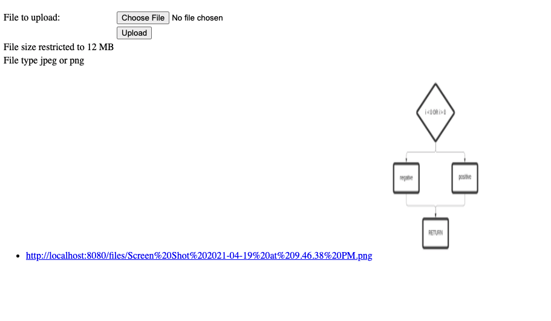

# Image Vault
Users can store their images in the cloud using ImageVault and access them at their own convenience. 

## Technologies 
Spring Boot, Thymeleaf and Java.

## Link
Azure link is down due to limited credits. Please feel free to download the copy and run on your local machine.

### Screenshots

